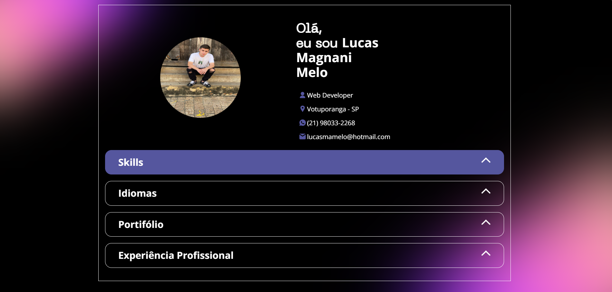

# 💼 JavaScript Developer Portfolio

Este repositório apresenta o meu **portfólio pessoal de desenvolvedor**, criado com o objetivo de reunir informações profissionais, projetos, habilidades técnicas e minha evolução na área de desenvolvimento web.

O projeto foi desenvolvido como uma forma de fortalecer minha presença profissional no GitHub e demonstrar, na prática, meus conhecimentos em **HTML, CSS e JavaScript**, aplicados na construção de uma interface moderna, organizada e responsiva.

---

## 🚀 Objetivo do Projeto

O principal objetivo deste portfólio é servir como uma vitrine profissional, permitindo apresentar:

- minha identidade como desenvolvedor;
- meus conhecimentos técnicos;
- meus projetos desenvolvidos;
- minha evolução na área de tecnologia;
- minha presença profissional na web.

Além de funcionar como um projeto de apresentação, este portfólio também contribui para consolidar fundamentos importantes do **Front-End**, como estruturação semântica, estilização visual, organização de conteúdo e interatividade com JavaScript.

---

## 🎯 Funcionalidades

- 📌 Apresentação pessoal e profissional
- 🧠 Exibição de habilidades técnicas
- 💻 Sessão para apresentação de projetos
- 📱 Layout responsivo para diferentes dispositivos
- 🎨 Interface moderna e organizada
- ⚡ Estrutura leve e de fácil navegação

---

## 🛠️ Tecnologias Utilizadas

Este projeto foi desenvolvido utilizando as seguintes tecnologias:

- **HTML5** → estruturação semântica da página
- **CSS3** → estilização, layout e responsividade
- **JavaScript** → interatividade e dinamismo da aplicação

---

## 🧠 Conceitos Aplicados

Durante o desenvolvimento deste projeto, foram praticados conceitos importantes como:

- Estruturação de páginas com HTML semântico
- Organização visual e estilização com CSS
- Responsividade para diferentes tamanhos de tela
- Manipulação de conteúdo com JavaScript
- Organização de arquivos e estrutura de projeto
- Construção de identidade visual para portfólio profissional

---

## 📂 Estrutura do Projeto

```bash
📦 js-developer-portfolio
 ┣ 📂 assets        # Imagens, ícones e arquivos visuais
 ┣ 📂 data          # Dados e conteúdos utilizados no projeto
 ┣ 📄 index.html    # Estrutura principal da aplicação
 ┣ 📄 style.css     # Estilização da interface
 ┣ 📄 script.js     # Lógica e interações com JavaScript
 ┗ 📄 README.md     # Documentação do projeto
```

---

## ▶️ Como Executar o Projeto

Para visualizar o projeto localmente, siga os passos abaixo:

### 1. Clone este repositório

```bash
git clone https://github.com/Lukinhax/js-developer-portfolio.git
```

### 2. Acesse a pasta do projeto

```bash
cd js-developer-portfolio
```

### 3. Abra o arquivo principal

Abra o arquivo `index.html` em seu navegador.

Se preferir, você também pode utilizar a extensão **Live Server** no VS Code para rodar o projeto localmente.

---

## 📸 Preview do Projeto


<p align="center">
  
</p>

---

## 📈 Aprendizados com este Projeto

Com o desenvolvimento deste portfólio, pude reforçar e evoluir habilidades importantes como:

- construção de interfaces web;
- organização visual de conteúdo;
- boas práticas de estruturação front-end;
- desenvolvimento de projetos com foco em apresentação profissional;
- criação de um projeto alinhado ao meu posicionamento como desenvolvedor.

Este projeto representa mais um passo importante na minha jornada de evolução na área de tecnologia, especialmente no foco em **desenvolvimento Front-End**.

---

## 🎓 Contexto do Projeto

Este portfólio foi desenvolvido como parte do meu processo de aprendizado e construção profissional na área de desenvolvimento web, com foco em consolidar conhecimentos práticos e fortalecer meu portfólio como estudante e futuro desenvolvedor.

---

## 📌 Status do Projeto

✔️ **Concluído**  
🚀 **Sujeito a melhorias futuras**

---
